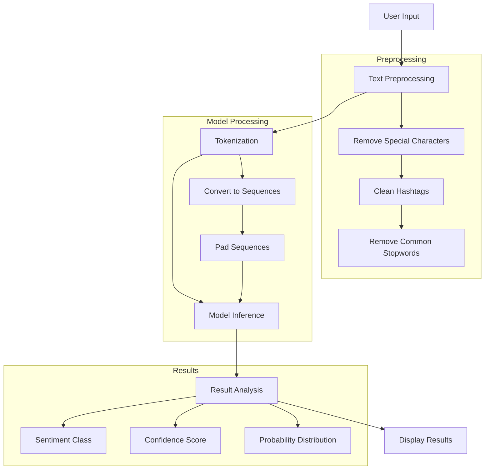

# Tweet Sentiment Analyzer

A powerful sentiment analysis web application that can analyze the sentiment of text and tweets, classifying them as Positive, Negative, or Neutral with confidence scores.

## Features

- Real-time sentiment analysis of text input
- Three-way classification (Positive, Negative, Neutral)
- Confidence scores and probability distribution for predictions
- Clean and intuitive web interface with loading indicators
- Built with Django and deep learning
- Pre-trained on Twitter data
- RESTful API endpoint for sentiment analysis

## Workflow



### Loading States

The application implements loading indicators at various stages:
1. **Input Processing**: Shows a spinner while cleaning and preprocessing text
2. **Model Analysis**: Displays a progress bar during sentiment analysis
3. **Result Generation**: Animated transition when displaying results
4. **API Requests**: Loading state for network operations

## Tech Stack

- **Backend**: Python, Django
- **Frontend**: HTML, Bootstrap, JavaScript
- **Machine Learning**: TensorFlow/Keras
- **Text Processing**: NLTK, Regular Expressions
- **Development Environment**: Python virtual environment (venv)

## Project Structure

```
sentiment_project/
├── sentiment_app/
│   ├── analyzer/
│   │   ├── sentiment_analyser.py
│   │   ├── twitter_sentiment_model.keras
│   │   ├── twitter_sentiment_tokenizer.pickle
│   │   └── twitter_sentiment_config.pickle
│   ├── templates/
│   │   └── sentiment_app/
│   │       └── index.html
│   ├── views.py
│   ├── urls.py
│   └── models.py
└── sentiment_project/
    ├── settings.py
    ├── urls.py
    └── wsgi.py
```

## Installation

1. Clone the repository:
```bash
git clone [repository-url]
cd Sentiment_anlyser
```

2. Create and activate a virtual environment:
```bash
python -m venv myenv
# On Windows
myenv\Scripts\activate
# On Unix or MacOS
source myenv/bin/activate
```

3. Install required dependencies:
```bash
pip install django tensorflow keras nltk numpy pandas
```

## Running the Application
1. Start the Django development server:
```bash
myenv/Scripts/python.exe sentiment_project\manage.py runserver
```

3. Open your web browser and visit:
```
http://127.0.0.1:8000/
```

## Usage

1. Visit the web application in your browser
2. Enter the text you want to analyze in the text area
3. Click "Analyze Sentiment"
   - A loading spinner appears while processing
   - Progress indicator shows analysis stages
4. View the results showing:
   - Predicted sentiment (Positive/Negative/Neutral)
   - Confidence score with animated progress bar
   - Probability distribution for all classes
   - Results fade in smoothly with animations
---

## Model Information

The sentiment analysis model is trained on Twitter data and can classify text into three categories:
- Positive
- Neutral
- Negative

The model uses a deep learning architecture with the following components:
- Text preprocessing and cleaning
- Tokenization
- Word embeddings
- Neural network classification

## API Usage

The application provides a REST API endpoint for sentiment analysis:

```bash
POST /analyze/
Content-Type: application/json

{
    "tweet": "Your text here"
}
```

Response format:
```json
{
    "text": "Original text",
    "cleaned_text": "Preprocessed text",
    "sentiment": "Predicted sentiment",
    "confidence": 0.95,
    "probabilities": {
        "Positive": 0.95,
        "Neutral": 0.03,
        "Negative": 0.02
    }
}
```

## License

[Add your license information here]

## Author

[Add your name/organization here]